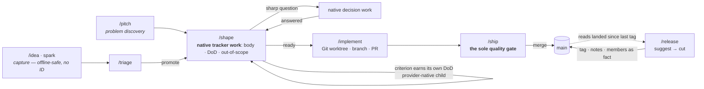

# 🍞 Loaf

> "Why have just a slice when you can get the whole loaf?"

Loaf is an opinionated agentic framework that gives AI coding assistants structured knowledge, enforced tool boundaries, and a coherent workflow from idea to implementation to learning. Write your skills once, deploy to Claude Code, OpenCode, Cursor, Codex, and Amp.

## Why Loaf?

**Portable knowledge** — Skills cover workflows, engineering standards, and language expertise. Build once, deploy to supported AI coding tools without rewriting anything.

**Project journal model** — A single SQLite-backed journal captures decisions and progress across every conversation, project-scoped and correlated by an opaque harness id. There is no session entity to open or close, so concurrent conversations across branches and worktrees stay conflict-free. Handoff artifacts live separately in `.agents/handoffs/`. Work survives context loss, compaction, and `/clear`.

**Tracker-native workflow** — The Loaf Flow is pitch → shape → implement → ship → release. `/pitch` authors a problem-space narrative; `/shape` creates or updates the canonical native tracker work contract through the selected provider skill. The tracker owns identity, body, definition of done, status, hierarchy, assignment, and collaboration. `/implement` uses repository-native Git mechanics; `/ship` is the sole quality gate and updates the native record after verification; `/release` cuts retroactively. Loaf never synchronizes a parallel local issue database with the tracker.

**Profile-based agents** — Functional profiles are defined by tool access, not job titles. A Smith with `python-development` skills becomes a backend engineer; the same Smith with `infrastructure-management` becomes a DevOps engineer. Skills determine what an agent knows; the profile determines what it can touch.

**Conversation continuity** — Pick up exactly where you left off with full traceability. The project journal captures decisions and progress in SQLite; a derived, ephemeral contract-v2 digest emits named journal and Git-derived active-truth layers with explicit availability and diagnostics at conversation start. Native tracker work is read through the selected provider and harness connection, never mirrored into this local digest. Explicit transfer packets live in `.agents/handoffs/` until housekeeping deletes them after deprecation.

**Hooks as quality gates** — Two hook types: enforcement hooks (pre-commit secrets scanning, pre-push linting) block bad commits automatically; skill instruction hooks inject context at tool invocation time. Language-aware and automatic.

## Workflow

Loaf keeps intent, implementation, and learning connected:



Everything left of ship plans **forward** and can be re-planned freely in the canonical tracker. Provider-native hierarchy is used only when supported with exact fidelity; questions too foggy to act on stay as prose until they sharpen. The release track reads **backward** from what actually landed. The private journal records continuity; `/reflect` and an optional `/wrap` preserve what the work taught.

### Pitch and Shape

Discover the problem, author a brief, then bound an implementable Issue (or bootstrap a project from a pitched BRIEF).

| Command | What It Does |
|---------|--------------|
| `/pitch` | Human problem-discovery: authors a problem narrative for shape, or project `docs/BRIEF.md` |
| `/idea` | Quick capture of rough ideas for later triage / pitch / shape |
| `/shape` | Bound canonical native tracker work in place (body, DoD criteria, out-of-scope), then verify by provider readback |
| `/bootstrap` | Populate operating docs; with `source: pitch`, gap-interview and create the initial native tracker arc |
| `/strategy` | Discover and document strategic direction |

### Implement and Ship

Implement a shaped issue through a started worktree and pull request, review the result, and land it through ship — the sole quality gate.

| Command | What It Does |
|---------|--------------|
| `/implement` | Execute a shaped issue with orchestrated agent delegation |
| `/ship` | Review, verify, and land one PR — the sole quality gate; tracker contract and verification evidence form the PR body |
| `/release` | Cut a retroactive release from already-landed issues (`loaf release suggest` / `cut`) |

### Preserve Learning

Integrate outcomes into strategic knowledge.

| Command | What It Does |
|---------|--------------|
| `/housekeeping` | Review and archive or delete lifecycle-complete artifacts |
| `/reflect` | Integrate learnings into strategic documents |
| `/handoff` | Package context for another agent, branch, issue, or future conversation |
| `/wrap` | Optional checkpoint for synthesis that is not otherwise derivable from the journal |

### Supporting Commands

CLI commands that support the workflow:

| Command | What It Does |
|---------|--------------|
| `loaf build` | Build all targets after modifying skills/agents |
| `loaf install` | Install to detected AI tools |
| `loaf config check` | Validate project config and installed Loaf-managed hooks |
| `loaf check` | Run enforcement hooks manually |
| `loaf project` | Manage durable project identity (show, rename, move) |
| `loaf issue` | Frozen legacy local-issue and one-time migration compatibility; not ongoing tracker work |
| `loaf kb` | Knowledge base management |
| `loaf journal` | Project journal: log, recent, search, show, context, export |
| `loaf housekeeping` | Review and archive agent artifacts |
| `loaf release` | Cut a retroactive release: `suggest` the range, `cut` the version |

## Profiles

Loaf uses functional profiles defined by mechanically enforced tool boundaries — not role titles, not domain labels. What an agent *can do* is fixed by its profile. What it *knows* comes from skills loaded at spawn time.

| Profile | Role | Tool Access | What It Does |
|---------|------|-------------|--------------|
| **Smith** | Implementer | Full write | Forges code, tests, config, and docs. Speciality determined by skills. |
| **Sentinel** | Reviewer | Read-only | Watches, guards, and verifies. Cannot modify what it reviews — by design. |
| **Ranger** | Researcher | Read + web | Scouts far, gathers intelligence, reports structured findings. |
| **Librarian** | Librarian | Read + Edit (.agents/) | Tends the project journal and durable `.agents/` artifacts, including wrap checkpoints. Does not forge code or scout. |

The main conversation is the **Warden** — it coordinates and delegates but never implements directly. See [SOUL.md](.agents/SOUL.md) for the full fellowship identity.

## Skills

### Workflow

Skills you invoke directly to drive work forward.

| Skill | Activates When |
|-------|----------------|
| `pitch` | Human problem-discovery; authors a problem narrative at issue scale or `docs/BRIEF.md` at project scale |
| `shape` | Shaping a brief or raw ask into a bounded issue |
| `implement` | Implementing a shaped issue |
| `ship` | Reviewing, verifying, and landing one PR (the sole quality gate) |
| `release` | Cutting a retroactive release from already-landed issues |
| `research` | Investigating questions, comparing options |
| `strategy` | Discovering or updating strategic direction |
| `architecture` | Creating Architecture Decision Records |
| `idea` | Quick capture of ideas for later evaluation |
| `triage` | Review and process intake queue (sparks + raw ideas); may hand to pitch or shape |
| `reflect` | Integrating learnings into strategic docs |
| `housekeeping` | Reviewing and archiving agent artifacts |
| `handoff` | Creating disposable transfer packets in `.agents/handoffs/` |
| `bootstrap` | Bootstrapping new or existing projects (initial issue arc after pitched BRIEF) |
| `linear` | Mapping `project-management/v1` operations to Linear through the harness's already-configured, authenticated native connection |
| `wrap` | Optional end-of-conversation checkpoint: shipped, pending, next |

Explore and brainstorm are agent techniques (not user slash entry); agents reach for them when direction is undecided — human entry intent routes to `/pitch`.

### Orchestration & Knowledge

Background skills that activate automatically during agent coordination and project management.

| Skill | Activates When |
|-------|----------------|
| `orchestration` | Journal continuity, delegating agents, and council workflows |
| `council` | Multi-perspective deliberation during complex decisions |
| `knowledge-base` | Managing project knowledge files |
| `loaf-reference` | Looking up which CLI command to use |

### Engineering Standards

Background knowledge that activates automatically to enforce quality.

| Skill | Activates When |
|-------|----------------|
| `foundations` | Writing code — style, naming, TDD, verification, code review |
| `git-workflow` | Branching, commits, PRs, squash merges |
| `debugging` | Diagnosing failures, tracking hypotheses, flaky tests |
| `security-compliance` | Threat modeling, secrets management, compliance checks |
| `documentation-standards` | ADRs, API docs, changelogs, Mermaid diagrams |

### Language & Domain

Domain expertise that loads based on project context.

| Skill | Activates When |
|-------|----------------|
| `typescript-development` | TypeScript, React, Next.js, Tailwind, Vitest |
| `python-development` | FastAPI, Pydantic, pytest, async patterns |
| `ruby-development` | Rails 8, Hotwire, Minitest |
| `go-development` | Go services, concurrency, testing |
| `interface-design` | UI/UX, accessibility (WCAG 2.1), design systems |
| `database-design` | Schema design, migrations, query optimization |
| `infrastructure-management` | Docker, Kubernetes, CI/CD, Terraform |
| `power-systems-modeling` | Thermal rating models, conductor physics |

## Multi-Target Support

Build once, deploy everywhere. Skills are the universal layer; profiles and hooks adapt per target.

| Target | Profiles | Skills | Hooks | Status |
|--------|:--------:|:------:|:-----:|--------|
| Claude Code | ✓ | ✓ | ✓ | Primary |
| OpenCode | ✓ | ✓ | ✓ | Full support |
| Cursor | ✓ | ✓ | ✓ | Full support |
| Codex | — | ✓ | Fallback | Skills + opt-in basic command policy |
| Amp | — | ✓ | — | Skills + runtime plugin |

## Getting Started

Install the `loaf` CLI, then let it onboard your harnesses.

### Install the CLI

macOS and Linux, one line:

```bash
bash -c "$(curl -fsSL https://raw.githubusercontent.com/levifig/loaf/main/install.sh)"
```

It downloads the release archive for your platform, verifies it against the release's `checksums.txt`, unpacks it under `~/.local/share/loaf/releases/<version>`, links `~/.local/bin/loaf`, and runs `loaf install`. Re-run the same line to move to a newer release. `LOAF_VERSION=0.5.0` pins a version, `--no-install` skips the harness step, `--uninstall` removes what it installed, and a `~/.local/bin/loaf` it did not create is never replaced.

Or with Homebrew:

```bash
brew tap levifig/tap
brew install loaf
loaf install
```

### Onboard your harnesses

`loaf install` onboards every harness it detects: OpenCode, Cursor, Codex, Amp, and Claude Code when the `claude` CLI is present. Narrow it when you want to:

```bash
loaf install -i                       # pick from a checklist
loaf install --to cursor,claude-code  # name targets
```

For Claude Code, the installed distribution registers itself as the `levifig-loaf` marketplace and installs `loaf@levifig-loaf` through the `claude` CLI. Commands are scoped under `loaf:` (for example `/loaf:implement`). The plugin ships content and hooks only; hooks invoke `loaf` from your PATH, without a bundled runtime, private pin, or fallback path. You manage the runtime version and must make it available to Claude Code. Installation warns when it is missing; plugin installation does not install or upgrade the runtime. Adding `levifig/loaf` from GitHub with `/plugin marketplace add` still works and tracks `main`, but the content then comes from GitHub rather than from your installed distribution.

### Keep it current

```bash
loaf upgrade
```

This refreshes every installed harness and the Claude Code plugin from the installed distribution. To update the binary itself, re-run the install one-liner or `brew upgrade loaf`; `loaf upgrade` tells you which one applies.

### Upgrading Existing Projects

Projects created with the older TypeScript runtime can keep using their existing `.agents/` Markdown files after installing the native Go runtime. If no SQLite database exists yet, Loaf runs supported report, journal, and housekeeping commands in `markdown-only` compatibility mode.

Use this sequence when you are ready to adopt SQLite-backed state:

```bash
loaf state status
loaf migrate markdown --dry-run
loaf migrate markdown --apply
loaf state status
```

The dry run counts importable artifacts and skipped files without creating a database. The apply step imports `.agents/` Markdown into the XDG data-home SQLite database without rewriting the source Markdown files. Loaf uses one global SQLite file and partitions rows by stable project ID, so multiple projects share the same database path while project queries stay isolated. Project IDs are not bound to the checkout path or friendly name; use `loaf project rename <name>` for display names and `loaf project move --from <old-path>` after moving a checkout. Newer graph-oriented commands such as `loaf issue`, `loaf idea`, `loaf spark`, `loaf tag`, `loaf bundle`, and `loaf link` require initialized SQLite state; run `loaf state init` for a fresh project or `loaf migrate markdown --apply` for an existing Markdown project.

### Recovery Tiers and Isolated Restore

Loaf keeps recovery claims explicit. `local_rollback` is the default same-data-home snapshot for local corruption rollback; project-scoped replay remains the ordinary migration rollback path; and `external_disaster_copy` is an operator-selected non-temporary external destination that may help with data-home or device loss but does not prove physical off-device durability. Every backup reports its resolved destination, checksum, SQLite validity, journal retrieval readiness, recovery readiness, and latest canonical journal watermark. `device_loss_protected` remains false because selecting a path is not evidence that it is remote or durable.

Create and verify backups with `loaf state backup`, `loaf state backup --to /absolute/external/directory`, and `loaf state backup verify <backup>`. Use `loaf state backup restore <backup> --to /absolute/empty/rehearsal/loaf.sqlite` for an isolated disposable rehearsal; the command proves an exact copy, integrity, foreign-key, schema, project, journal, search-parity, and watermark match without opening or mutating the live database.

Activating a verified copy is a manual, quiesced operator procedure, not an automated restore command:

1. Stop or terminate every Loaf process, harness, background writer, and related service, then verify universal quiescence before any quarantine or activation step. Loaf has no automated live mutation lease and makes no concurrent-restore claim.
2. Verify the durable backup and complete the isolated disposable rehearsal, then create and retain a preserve-current backup before changing the live data home.
3. While all writers remain quiesced, move the old main database and any matching `-wal` and `-shm` sidecars together into a durable quarantine. Never mix sidecars from different database files, and never move only the main file when a sidecar belongs to it.
4. Install the verified copy at the resolved live database path with mode `0600`, start current Loaf, and run `loaf state doctor`, `loaf state status`, and a known journal retrieval check.
5. If validation fails, quiesce again and activate the preserve-current copy using the same procedure; do not continue with concurrent writers.

**Install locations:**

| Target | Location |
|--------|----------|
| OpenCode | `~/.config/opencode/` or `~/.opencode/` |
| Cursor | `~/.cursor/` |
| Codex | `$CODEX_HOME/skills/` or `~/.codex/skills/` |
| Amp | `~/.amp/` plus configured skill/plugin locations |

## Integrations

**MCP Servers:** Configure Linear directly in each harness and expose one account-specific server per project; the Linear and bootstrap skills record its name in `.agents/loaf.json` but do not install or authenticate it. **Optional:** Serena provides semantic editing for large codebases and can be configured through `loaf install`.

**Claude Code LSP Servers:** gopls, pyright, typescript-language-server, solargraph

## Development

```bash
git clone https://github.com/levifig/loaf.git
cd loaf
make build
```

A development build carries its source commit inside the binary (`loaf --version` reports `<version>+g<short-sha>`, plus `.dirty` when the tree had uncommitted changes) and updates Loaf's user-local launcher pointer (`$XDG_DATA_HOME/loaf/current-dev-launcher`). `~/.local/bin/loaf` is created only when that name is absent, as a symlink to the pointer, so the last worktree built becomes the active CLI when the PATH name is free. Set `LOAF_DEV_LINK=0` to opt out; an existing real file, directory, or any other symlink is never overwritten. Activation is best-effort and never fails a successful native build. A failed multi-target rebuild leaves the previous successful `bin/native` binaries in place. Root `bin/` is a build output and is not tracked.

See [AGENTS.md](AGENTS.md) for development guidelines.

```bash
make typecheck       # Compile check
make test            # Run tests
loaf build           # Build all targets (after the initial make build)
loaf install         # Onboard detected harnesses from this checkout
```

Everything runs through Go and `make`; there is no npm. Node is needed only for the harness capability runners under `cli/scripts/`.

**Testing locally:** run `loaf install` from the checkout after `make build`. It registers the checkout as the Claude Code marketplace and installs the other harnesses from `dist/`; `loaf install -i` picks a subset.

## License

MIT
