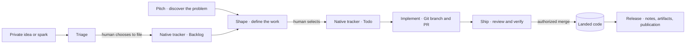

# 🍞 Loaf

> "Why have just a slice when you can get the whole loaf?"

Loaf brings shared skills, a native Go CLI, and tracker-native workflows to Claude Code, OpenCode, Cursor, Codex, and Amp. Skills guide judgment, the CLI handles deterministic checks and private continuity, and your tracker owns shared work.

This README describes the current source tree. Until its next release is published, installation from GitHub Releases or Homebrew may provide an earlier version; see the [published releases](https://github.com/levifig/loaf/releases) and [unreleased changes](CHANGELOG.md#unreleased).

## Why Loaf?

**Portable knowledge** — Skills cover workflows, engineering standards, and language expertise. Build once, deploy to supported AI coding tools without rewriting anything.

**Private continuity** — A project-scoped SQLite journal records decisions, discoveries, and optional wrap summaries across conversations and worktrees. There is no session entity to open or close. Startup context is derived from the journal and Git; useful resumption depends on recording meaningful context, not retaining a second work queue.

**Tracker-native workflow** — Pitch → shape → implement → ship → release keeps discovery, selected work, review, and publication distinct. GitHub and Linear provider skills use connections already available in your harness; Loaf never synchronizes a parallel local issue database, and does not configure their credentials. On GitHub, the selected board's Status distinguishes noncommittal Backlog from selected Todo work.

**Profile-based agents** — Functional profiles are defined by tool access, not job titles. A Smith with `python-development` skills becomes a backend engineer; the same Smith with `infrastructure-management` becomes a DevOps engineer. Skills determine what an agent knows; the profile determines what it can touch.

**Living architecture** — Keep current design and rationale in topic-based `docs/architecture/` documents. Architecture and Reflect update that current account; separate decision records are rare and narrow, while Git preserves superseded text.

**Native checks** — Supported harness hooks invoke `loaf` from your PATH for secrets, destructive-command safety, naming, and other checks. Blocking checks refuse the matching action; advisory checks provide guidance. These tool hooks do not imply repository-wide Git-hook enforcement outside the harness.

## Workflow

Loaf keeps intent, implementation, and learning connected:



Filing an idea does not authorize implementation. Shaping a definition does not select it into Todo by itself, and bare `/implement` reports the unblocked Todo frontier without starting. Ship is the sole quality gate; release reads backward from already-landed work. Reflect and an optional wrap preserve what the work taught.

The slash forms below are shorthand: Claude Code's plugin uses `/loaf:name` (for example `/loaf:shape`); other supported harnesses use `/name` where they expose skill commands.

### Pitch and Shape

Discover the problem, author a brief, then bound an implementable Issue (or bootstrap a project from a pitched BRIEF).

| Command | What It Does |
|---------|--------------|
| `/pitch` | Human problem-discovery: authors a problem narrative for shape, or project `docs/BRIEF.md` |
| `/idea` | Quick capture of rough ideas for later triage / pitch / shape |
| `/shape` | Bound canonical native tracker work in place (body, DoD criteria, out-of-scope), then verify by provider readback |
| `/bootstrap` | Populate operating docs; with `source: pitch`, gap-interview and create the initial native tracker arc |
| `/strategy` | Discover and document strategic direction |

### Implement and Ship

Implement a shaped issue through a started worktree and pull request, review the result, and land it through ship — the sole quality gate.

| Command | What It Does |
|---------|--------------|
| `/implement` | Execute a shaped issue with orchestrated agent delegation |
| `/ship` | Review, verify, and land one PR — the sole quality gate; tracker contract and verification evidence form the PR body |
| `/release` | Prepare and publish already-landed work retroactively through Git and the repository's release tooling, with explicit publication approval |

### Preserve Learning

Integrate outcomes into strategic knowledge.

| Command | What It Does |
|---------|--------------|
| `/housekeeping` | Review and archive or delete lifecycle-complete artifacts |
| `/reflect` | Integrate learnings into strategic documents |
| `/handoff` | Package context for another agent, branch, issue, or future conversation |
| `/wrap` | Optional checkpoint for synthesis that is not otherwise derivable from the journal |

### Supporting Commands

CLI commands that support the workflow:

| Command | What It Does |
|---------|--------------|
| `loaf build` | Build all targets after modifying skills/agents |
| `loaf install` | Install to detected AI tools |
| `loaf config check` | Validate project config and installed Loaf-managed hooks |
| `loaf check` | Run enforcement hooks manually |
| `loaf project` | Manage durable project identity (show, rename, move) |
| `loaf issue` | Frozen legacy local-issue and one-time migration compatibility; not ongoing tracker work |
| `loaf kb` | Discover and validate project knowledge, including architecture topics |
| `loaf journal` | Project journal: log, recent, search, show, context, export |
| `loaf housekeeping` | Review and archive agent artifacts |
| `loaf upgrade --dry-run` | Inspect managed-content updates and conflicts before applying |
| `loaf upgrade --select <target/id>` | Apply only explicitly selected managed artifacts |

Historical `loaf issue` and `loaf release suggest/cut` commands remain compatibility surfaces. They do not replace the native tracker or define the current Release skill's publication authority.

## Profiles

Loaf defines functional agent profiles by intended tool boundaries, with domain knowledge supplied by skills. Enforcement depends on the host's agent and permission mechanisms; a profile name alone is not a sandbox.

| Profile | Role | Tool Access | What It Does |
|---------|------|-------------|--------------|
| **Smith** | Implementer | Full write | Forges code, tests, config, and docs. Speciality determined by skills. |
| **Sentinel** | Reviewer | Read-only | Watches, guards, and verifies. Cannot modify what it reviews — by design. |
| **Ranger** | Researcher | Read + web | Scouts far, gathers intelligence, reports structured findings. |
| **Librarian** | Librarian | Read + Edit (.agents/) | Tends the project journal and durable `.agents/` artifacts, including wrap checkpoints. Does not forge code or scout. |

The coordinating conversation is the **Warden**. Delegation follows the active harness's tools and the project's instructions; independent reviews remain read-only.

## Skills

### Workflow

Skills you invoke directly to drive work forward.

| Skill | Activates When |
|-------|----------------|
| `pitch` | Human problem-discovery; authors a problem narrative at issue scale or `docs/BRIEF.md` at project scale |
| `shape` | Shaping a brief or raw ask into a bounded issue |
| `implement` | Implementing a shaped issue |
| `ship` | Reviewing, verifying, and landing one PR (the sole quality gate) |
| `release` | Cutting a retroactive release from already-landed issues |
| `research` | Investigating questions, comparing options |
| `strategy` | Discovering or updating strategic direction |
| `architecture` | Maintaining current architecture topics and exceptional, narrow decision records |
| `idea` | Quick capture of ideas for later evaluation |
| `triage` | Review and process intake queue (sparks + raw ideas); may hand to pitch or shape |
| `reflect` | Integrating learnings into strategic docs |
| `housekeeping` | Reviewing and archiving agent artifacts |
| `handoff` | Creating disposable transfer packets in `.agents/handoffs/` |
| `bootstrap` | Bootstrapping new or existing projects (initial issue arc after pitched BRIEF) |
| `linear` | Mapping `project-management/v1` operations to Linear through the harness's already-configured, authenticated native connection |
| `github` | Mapping native issues and the selected GitHub board's workflow through an already-authenticated harness connection |
| `wrap` | Optional end-of-conversation checkpoint: shipped, pending, next |

Explore and brainstorm are agent techniques (not user slash entry); agents reach for them when direction is undecided — human entry intent routes to `/pitch`.

### Orchestration & Knowledge

Background skills that activate automatically during agent coordination and project management.

| Skill | Activates When |
|-------|----------------|
| `orchestration` | Journal continuity, delegating agents, and council workflows |
| `council` | Multi-perspective deliberation during complex decisions |
| `knowledge-base` | Managing project knowledge files |
| `loaf-reference` | Looking up which CLI command to use |

### Engineering Standards

Background knowledge that activates automatically to enforce quality.

| Skill | Activates When |
|-------|----------------|
| `foundations` | Writing code — style, naming, TDD, verification, code review |
| `git-workflow` | Branching, commits, PRs, squash merges |
| `debugging` | Diagnosing failures, tracking hypotheses, flaky tests |
| `security-compliance` | Threat modeling, secrets management, compliance checks |
| `documentation-standards` | ADRs, API docs, changelogs, Mermaid diagrams |

### Language & Domain

Domain expertise that loads based on project context.

| Skill | Activates When |
|-------|----------------|
| `typescript-development` | TypeScript, React, Next.js, Tailwind, Vitest |
| `python-development` | FastAPI, Pydantic, pytest, async patterns |
| `ruby-development` | Rails 8, Hotwire, Minitest |
| `go-development` | Go services, concurrency, testing |
| `interface-design` | UI/UX, accessibility (WCAG 2.1), design systems |
| `database-design` | Schema design, migrations, query optimization |
| `infrastructure-management` | Docker, Kubernetes, CI/CD, Terraform |
| `power-systems-modeling` | Thermal rating models, conductor physics |

## Multi-Target Support

Build once, deploy everywhere. Skills are the universal layer; profiles and hooks adapt per target.

| Target | Profiles | Skills | Hooks | Status |
|--------|:--------:|:------:|:-----:|--------|
| Claude Code | ✓ | ✓ | ✓ | Primary |
| OpenCode | ✓ | ✓ | ✓ | Full support |
| Cursor | ✓ | ✓ | ✓ | Full support |
| Codex | — | ✓ | ✓ | Skills, hooks, and opt-in classified command policy |
| Amp | — | ✓ | Runtime plugin | Skills and native delegation integrations |

Compatibility is checked by required capabilities, not a whitelist of exact harness versions. Full Node/JavaScript removal is not complete: some harness adapters and development checks still use TypeScript/JavaScript. The Loaf executable and maintained migrated helpers are native Go.

## Getting Started

Install the `loaf` CLI, then let it onboard your harnesses.

### Install the CLI

macOS and Linux, one line:

```bash
bash -c "$(curl -fsSL https://raw.githubusercontent.com/levifig/loaf/main/install.sh)"
```

It downloads the release archive for your platform, verifies it against the release's `checksums.txt`, unpacks it under `~/.local/share/loaf/releases/<version>`, links `~/.local/bin/loaf`, and runs `loaf install`. Re-run it to acquire a newer release, or set `LOAF_VERSION` to an already-published version. `--no-install` skips harness changes; `--uninstall` removes installer-owned files. An existing PATH entry it does not own is never replaced. The bootstrap script needs Bash and download/archive tools; running the installed Loaf CLI needs neither Node nor a Go toolchain.

Or with Homebrew:

```bash
brew tap levifig/tap
brew install loaf
loaf install
```

### Onboard your harnesses

`loaf install` onboards every harness it detects: OpenCode, Cursor, Codex, Amp, and Claude Code when the `claude` CLI is present. Narrow it when you want to:

```bash
loaf install -i                       # pick from a checklist
loaf install --to cursor,claude-code  # name targets
```

For Claude Code, choose one content source:

- **Installed distribution:** `loaf install --to claude-code` registers that distribution as the `levifig-loaf` marketplace and installs `loaf@levifig-loaf`. Keep the source directory available while registered.
- **GitHub main:** `claude plugin marketplace add levifig/loaf` followed by `claude plugin install loaf@levifig-loaf --scope user` lets Claude maintain its own checkout of current source. This can be newer than the latest CLI release.

These are alternatives, not two simultaneous owners. Loaf refuses to replace a same-named marketplace pointing elsewhere. Inspect existing registrations before changing channels; native marketplace removal also uninstalls its plugins.

The Claude plugin ships content and hooks only. Commands use `/loaf:name`, and hooks invoke bare `loaf` from user-managed PATH without a bundled binary, private pin, or fallback. You choose the runtime and upgrade it when required capabilities are missing. Plugin installation does not acquire or switch that runtime.

### Keep it current

```bash
loaf upgrade --dry-run
loaf upgrade                  # Apply after reviewing the plan
```

`loaf upgrade` refreshes managed content; it does not replace your PATH executable. Update that binary through its owner, such as the installer or `brew upgrade loaf`.

For a GitHub-backed Claude marketplace, refresh it through Claude instead:

```bash
claude plugin marketplace update levifig-loaf
claude plugin update loaf@levifig-loaf --scope user
```

Restart existing Claude sessions after a plugin refresh. A distribution-driven Loaf upgrade will report a conflict for a differently sourced Claude marketplace; narrow other harness updates with `--to cursor,opencode,codex,amp` as appropriate.

When only selected artifacts should change, use plan IDs from the dry run:

```bash
loaf upgrade --select skills/skill:architecture --dry-run
loaf upgrade --select skills/skill:architecture
```

Scoped upgrades preserve unselected artifacts and version stamps, recheck ownership under a lock, and roll back on failure. Modified or foreign files are not disposable. Missing or incapable PATH runtimes produce install/upgrade guidance; an older but capable runtime is acceptable.

### Upgrading Existing Projects

Projects created with the older TypeScript runtime can keep using their existing `.agents/` Markdown files after installing the native Go runtime. If no SQLite database exists yet, Loaf runs supported report, journal, and housekeeping commands in `markdown-only` compatibility mode.

Use this sequence when you are ready to adopt SQLite-backed state:

```bash
loaf state status
loaf migrate markdown --dry-run
loaf migrate markdown --apply
loaf state status
```

The dry run counts importable artifacts and skipped files without creating a database. The apply step imports `.agents/` Markdown into the XDG data-home SQLite database without rewriting the source Markdown files. Loaf uses one global SQLite file and partitions rows by stable project ID, so multiple projects share the same database path while project queries stay isolated. Project IDs are not bound to the checkout path or friendly name; use `loaf project rename <name>` for display names and `loaf project move --from <old-path>` after moving a checkout. Newer graph-oriented commands such as `loaf issue`, `loaf idea`, `loaf spark`, `loaf tag`, `loaf bundle`, and `loaf link` require initialized SQLite state; run `loaf state init` for a fresh project or `loaf migrate markdown --apply` for an existing Markdown project.

### Recovery Tiers and Isolated Restore

Loaf keeps recovery claims explicit. `local_rollback` is the default same-data-home snapshot for local corruption rollback; project-scoped replay remains the ordinary migration rollback path; and `external_disaster_copy` is an operator-selected non-temporary external destination that may help with data-home or device loss but does not prove physical off-device durability. Every backup reports its resolved destination, checksum, SQLite validity, journal retrieval readiness, recovery readiness, and latest canonical journal watermark. `device_loss_protected` remains false because selecting a path is not evidence that it is remote or durable.

Create and verify backups with `loaf state backup`, `loaf state backup --to /absolute/external/directory`, and `loaf state backup verify <backup>`. Use `loaf state backup restore <backup> --to /absolute/empty/rehearsal/loaf.sqlite` for an isolated disposable rehearsal; the command proves an exact copy, integrity, foreign-key, schema, project, journal, search-parity, and watermark match without opening or mutating the live database.

Activating a verified copy is a manual, quiesced operator procedure, not an automated restore command:

1. Stop or terminate every Loaf process, harness, background writer, and related service, then verify universal quiescence before any quarantine or activation step. Loaf has no automated live mutation lease and makes no concurrent-restore claim.
2. Verify the durable backup and complete the isolated disposable rehearsal, then create and retain a preserve-current backup before changing the live data home.
3. While all writers remain quiesced, move the old main database and any matching `-wal` and `-shm` sidecars together into a durable quarantine. Never mix sidecars from different database files, and never move only the main file when a sidecar belongs to it.
4. Install the verified copy at the resolved live database path with mode `0600`, start current Loaf, and run `loaf state doctor`, `loaf state status`, and a known journal retrieval check.
5. If validation fails, quiesce again and activate the preserve-current copy using the same procedure; do not continue with concurrent writers.

**Install locations:**

| Target | Location |
|--------|----------|
| OpenCode | `~/.config/opencode/` or `~/.opencode/` |
| Cursor | `~/.cursor/` |
| Shared skills | `~/.agents/skills/` for supported store-sharing harnesses |
| Claude Code | Claude-managed marketplace and plugin cache |
| Codex | `$CODEX_HOME` or `~/.codex/` for hooks/policy; shared skills where supported |
| Amp | `~/.amp/` plus configured skill/plugin locations |

## Integrations

**Tracker connections:** Select GitHub or Linear through an already-authenticated connection exposed by your harness. GitHub workflows require the exact repository and a selected board with Backlog, Todo, In Progress, and Done lanes; In Review is supported when present. Provider credentials and live work remain outside Loaf's CLI. **Optional:** Serena provides semantic editing and can be configured through the install flow.

**Claude Code LSP Servers:** gopls, pyright, typescript-language-server, solargraph

## Development

```bash
git clone https://github.com/levifig/loaf.git
cd loaf
LOAF_DEV_LINK=0 make build
```

A development build carries its source commit inside the binary (`loaf --version` reports `<version>+g<short-sha>`, plus `.dirty` when the tree had uncommitted changes) and updates Loaf's user-local launcher pointer (`$XDG_DATA_HOME/loaf/current-dev-launcher`). `~/.local/bin/loaf` is created only when that name is absent, as a symlink to the pointer, so the last worktree built becomes the active CLI when the PATH name is free. Set `LOAF_DEV_LINK=0` to opt out; an existing real file, directory, or any other symlink is never overwritten. Activation is best-effort and never fails a successful native build. A failed multi-target rebuild leaves the previous successful `bin/native` binaries in place. Root `bin/` is a build output and is not tracked.

See [AGENTS.md](AGENTS.md) for development guidelines.

```bash
make verify-local    # Full Go tests, static checks, adapter tests, and build validation
make ci-check        # Reproduce the bounded remote checks locally
make vulncheck       # Network-backed vulnerability audit; run before release or after dependency changes
bin/loaf build       # Rebuild content using this checkout's executable
bin/loaf upgrade --dry-run  # Preview existing-install changes from this checkout
```

Build, release, and packaging orchestration runs through Go and `make`; there is no npm install step. Use the Go toolchain declared in `go.mod`. `make verify-local` requires Node and the existing TypeScript compiler (`tsc`) on PATH, runs all deterministic adapter tests without launching live harness sessions, and sets `LOAF_DEV_LINK=0` for its build. Review regenerated content and include it with the source that produced it. `make ci-check` additionally requires generated files to match the Git index, as they must in a clean CI checkout. Individual `test`, `typecheck`, `vet`, `cgo-free`, `capability-tests`, and `verify-generated` targets remain available for focused work.

Most verification runs locally before review and tagging. Default CI runs a fixed set of uncached smoke tests plus CGO-free build, generated-content validation, and drift checks; `make ci-smoke` runs only the selected tests. Each smoke package has a two-minute test timeout, and the default CI job has a ten-minute total limit including setup and compilation. Release automation runs only `make release-smoke` before constructing all platform archives, checking version and checksums, and publishing. It does not replace comprehensive local verification. See [Runtime and Delivery](docs/architecture/runtime-and-delivery.md) for the check selection and boundary policy.

**Testing locally:** distribution content is resolved from the executable, not the working directory. Use `bin/loaf` for this checkout after building with `LOAF_DEV_LINK=0`. When live onboarding is explicitly intended, `bin/loaf install -i` selects harnesses and applies changes; install has no dry-run mode. Claude registration is refused if the same marketplace name already points elsewhere. Use isolated homes for installation tests so verification does not change your live setup.

## License

MIT
