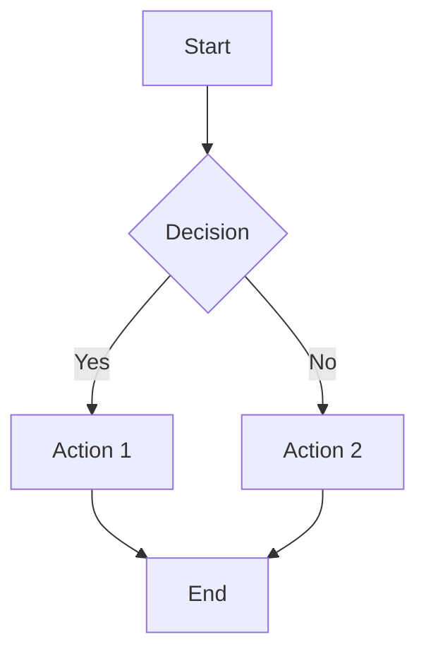
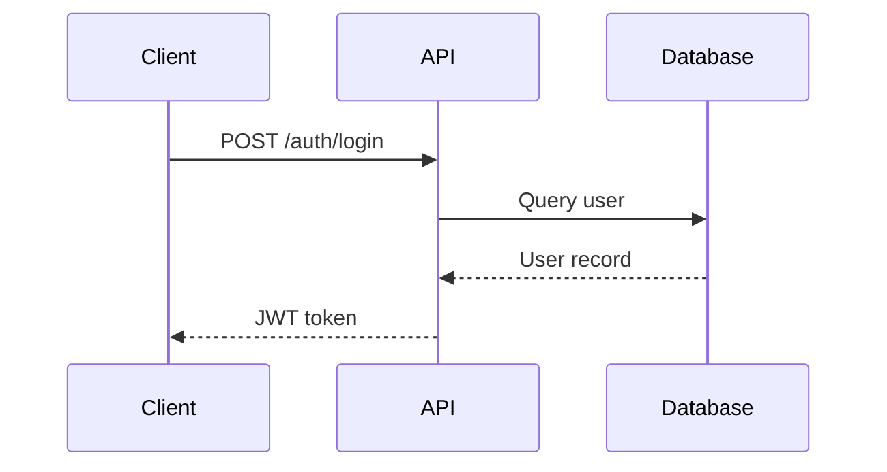
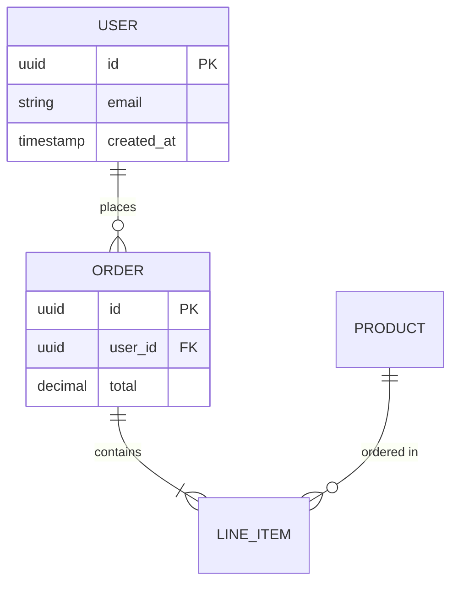
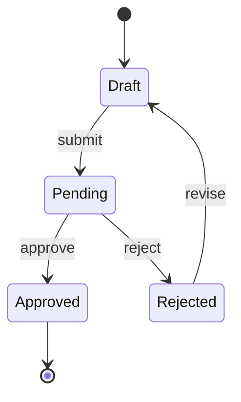
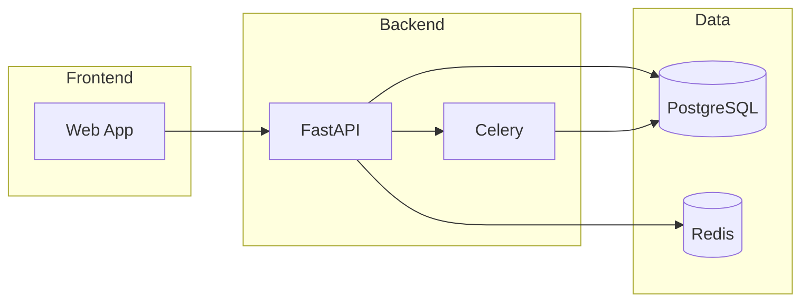
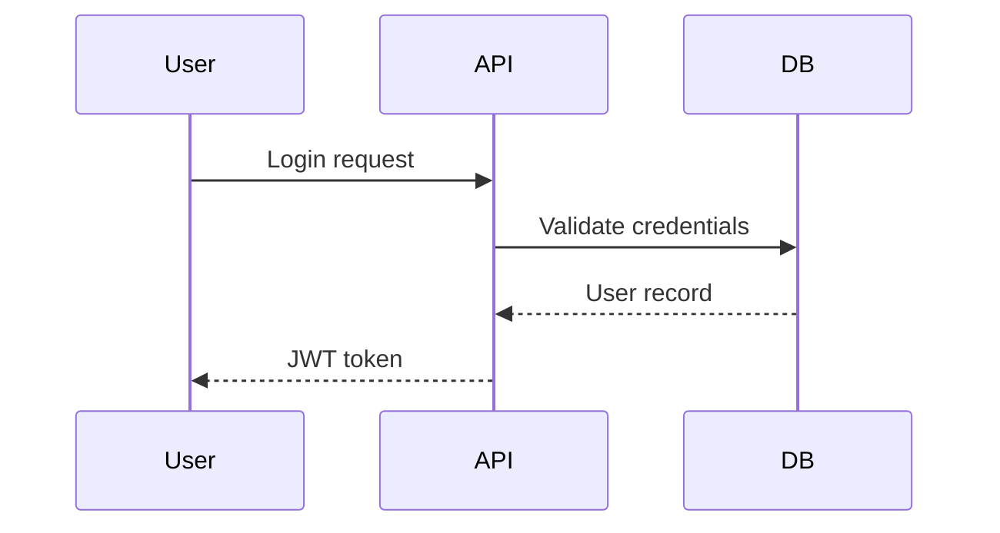

# Architecture Diagrams

Guidelines for creating Mermaid diagrams to visualize system architecture and data flows.

## When to Create Diagrams

Create architecture diagrams when work involves:

| Scenario | Diagram Type | Why |
|----------|--------------|-----|
| Multi-service changes | Component/flowchart | Shows interaction points and dependencies |
| Data flow changes | Sequence/flowchart | Traces data through the system |
| Schema modifications | ERD | Visualizes table relationships |
| API design | Sequence | Documents request/response flows |
| State machine logic | State diagram | Clarifies transitions and conditions |
| Complex conditionals | Flowchart | Makes branching logic explicit |

### Skip Diagrams When

- Single-file changes with obvious scope
- Bug fixes with no architectural impact
- Configuration-only changes
- Test additions (unless testing complex flows)

## Mermaid Syntax Quick Reference

### Flowchart (Most Common)



**Direction options:** `TD` (top-down), `LR` (left-right), `BT` (bottom-top), `RL` (right-left)

**Node shapes:**
- `[Rectangle]` - Process/action
- `{Diamond}` - Decision
- `([Stadium])` - Start/end
- `[(Database)]` - Database
- `((Circle))` - Connector

### Sequence Diagram (API/Service Interaction)



**Arrow types:**
- `->>` Solid line with arrowhead (sync call)
- `-->>` Dashed line with arrowhead (response)
- `--)` Async message

### Entity Relationship Diagram (Schema)



**Relationship notation:**
- `||` One (required)
- `o|` Zero or one
- `}|` One or many
- `}o` Zero or many

### State Diagram (State Machines)



### Component Diagram (System Architecture)



## Storage Patterns

### Inline in Session File

Best for: Diagrams specific to current work, temporary visualizations

```markdown
## Architecture Diagrams

### Auth Flow

**Purpose**: Visualize the authentication flow being implemented
**Files involved**: `backend/auth/`, `backend/models/user.py`
```

### Stored in `.agents/diagrams/`

Best for: Reusable diagrams, cross-session reference, team documentation

```
.agents/diagrams/
├── system-architecture.md
├── auth-flow.md
└── data-pipeline.md
```

**Diagram file format:**

```markdown
---
created: 2025-01-23T14:00:00Z
last_updated: 2025-01-23T14:00:00Z
tags: [auth, api, security]
---

# Auth Flow Diagram

## Overview

Documents the authentication and authorization flow for the API.

## Diagram

```mermaid
[diagram content]
```

## Related Files

- `backend/auth/jwt.py` - JWT generation
- `backend/middleware/auth.py` - Auth middleware
- `backend/models/user.py` - User model

## Notes

Any additional context about this diagram.
```

### When to Store vs Inline

| Store in `.agents/diagrams/` | Keep Inline in Session |
|------------------------------|------------------------|
| Referenced by multiple sessions | One-time visualization |
| Documents stable architecture | Documents work-in-progress |
| Shared across team members | Personal understanding aid |
| Likely to be updated | Disposable after task |

## Best Practices

### Keep Diagrams Focused

```markdown
# Good: Single concern
Auth flow diagram showing login -> validate -> token

# Bad: Everything at once
Entire system with auth, billing, notifications, logging...
```

### Use Consistent Naming

```markdown
# In diagrams, use actual names from code
API[auth-service]  # Matches service name
DB[(users)]        # Matches table name

# Not generic placeholders
API[Service A]
DB[(Database)]
```

### Add Context

Every diagram needs:
1. **Purpose** - Why this diagram exists
2. **Files involved** - What code it represents
3. **Limitations** - What it does NOT show

### Update When Code Changes

Diagrams are documentation. When the code they represent changes:
1. Update the diagram
2. Update `last_updated` timestamp
3. Note the change in session log

## Anti-Patterns

| Don't | Do Instead |
|-------|------------|
| Diagram everything | Diagram only complex flows |
| Include implementation details | Show architectural relationships |
| Create diagrams after code | Create during planning |
| Leave stale diagrams | Update or delete |
| Use inconsistent notation | Follow Mermaid conventions |
